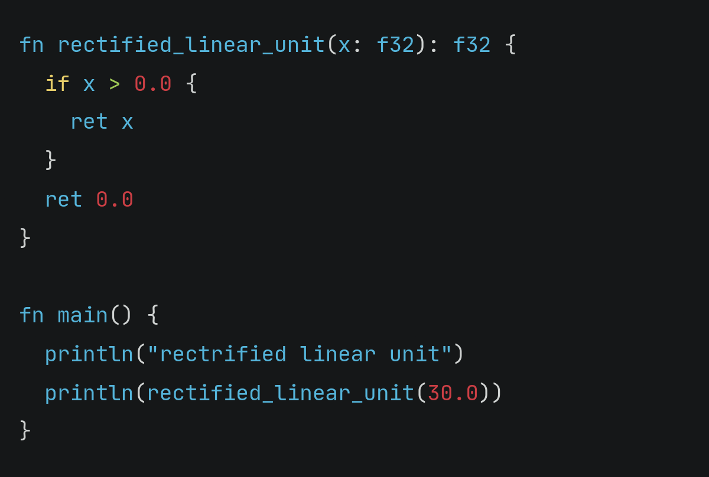
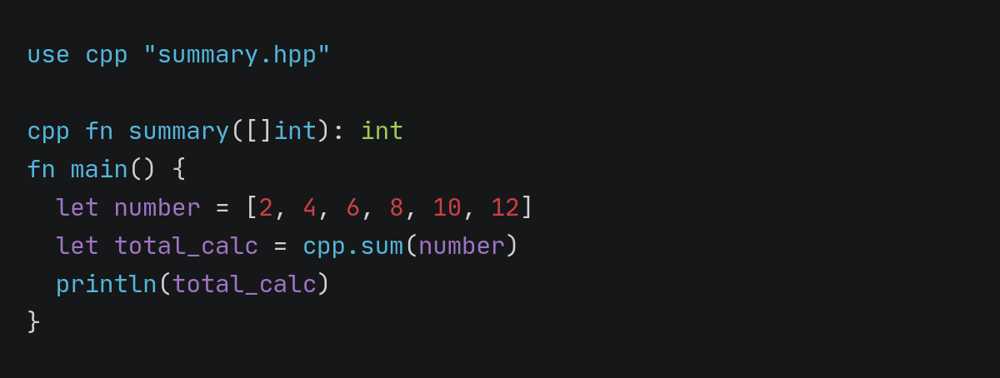
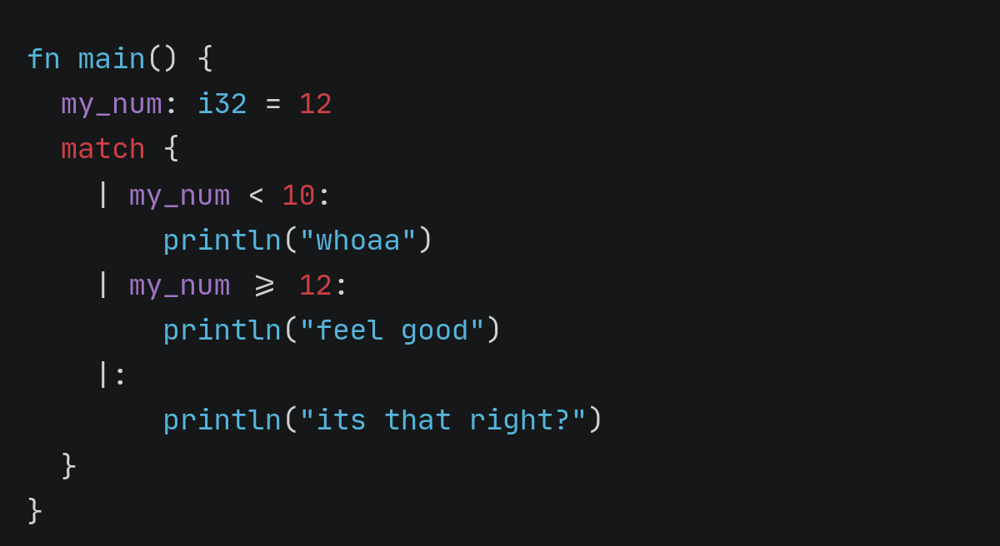
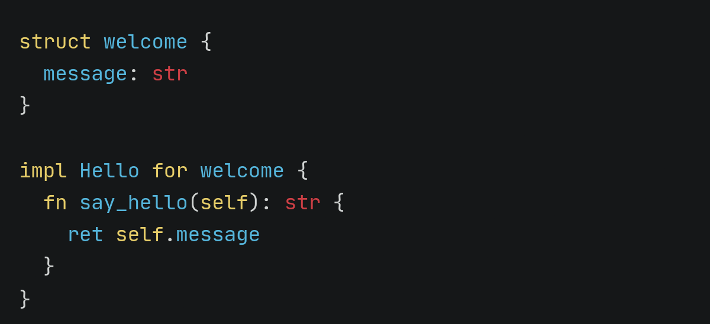
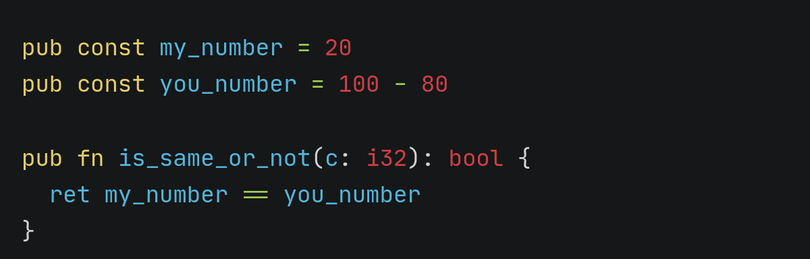
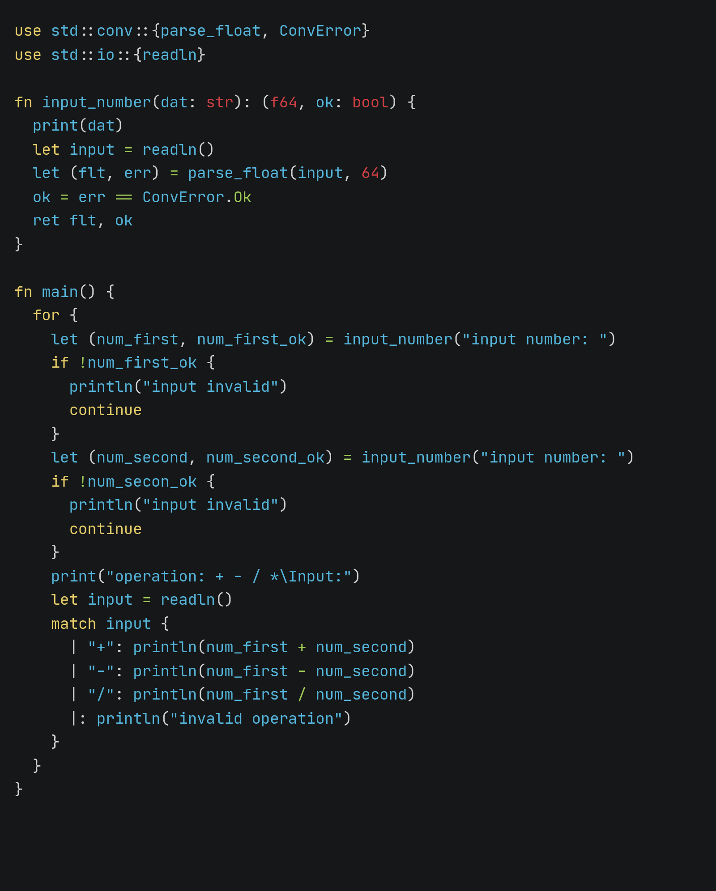
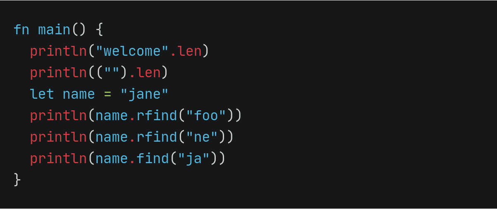

Jane is early experimental compiled programming language, static type, fast, modern and simple. jane design for maintainable and reliable software development. ensure memory safety and commits not to contain undefined behavior, contains a reference compiler withfeatures that help developers to design safe applications.

## CPP interopability

jane is meant to work with cpp, a cpp header file depedence can be added to the jane code, allowing its functions to be linked. writting cpp code that is compatible with the jane code created by compiler is rather straightforward. jane stores all of cpp code it uses for jane in the `api` directory. this API make it feasible and easy to develop cpp programming that can be completely integrated with jane

## Feature of jn

- simple
- fast and scaleable development
- performance-critical software
- memory safety
- fun

## Information

memory safety and memory management are significant challenges in C, CPP, and other computer languages. jane feature a reference-based memory management design that addresses theses difficulties. jane ensure memory safety by utilizing reference counting for memory managemet. ang account allotment is immediately withdraw when the reference count approaches zero.

jane still in early development and can only be constructed from source. despite their early development stage, many algorithm (you can se on [standard library jane](std)) can be effectively implemented. its is planned to rebuild the compiler with jane once the reference compiler and standard library have matured sufficiciently, jane has or is near to hacing mane of the feature that jane was designed to have, incliding memory safety, properties, structure with methods, and generics.

> \[!NOTE\]\
> Release is not planned until jane is build using jane programming languages, the syntax and language design of jane programming language have emerged, and no sustansial revision are envisaged, when the reference compiler is rewritten using jane, it is expected that AST, Lexer, and certain packages will be included in the standard library, this is modification that will need official compiler's project structure to be rebuilt, the reference compiler is likely to make extensive use of standard library, this will also allow developer to easily create language-specific utilities using jane standard library.

## Build

> \[!NOTE\]
> currently not fully documented for build the jane compiler, but you can check on `Makefile` on `src` and can check the binary files or exec program on `bin` after the project was build.

## showcase

