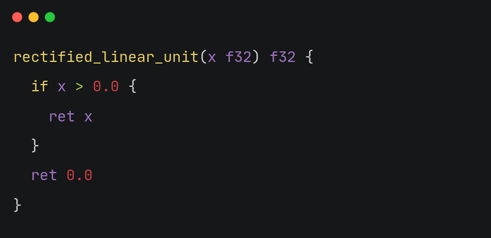

Jane is early experimental compiled programming language, static type, fast, modern and simple. the
flow of jane source compiled, its to translate to C++ code and compiled it from
C++ code. Transpile to C++ only instead of compiling is also an Optional. the
mission to be advance, readable and good choice for system programming



## feature of jn

- simple
- efficient performance as C/C++
- deffered call
- language intergrated concurrency
- generic programming
- C/C++ embed
- return type identifier
- multiple assignment
- multiple function return
- type constant
- argument targettting

## memory on jane

memory safety and memory management. a significant problem in C, C++, or comparable programming langauges. jane use reference counting to control memory and ensure memory safety. an account allotment is immediately withdrawn when the reference count approaches zero. there are no hanging pointers, and accessing null pointer will plainly result in an error.

## information

the project structure, including its lexical and syntactic structure, has now revealed. however, if there reference compiler is rewritten in jane, it is expected that AST, Lexer, and certain packages will be included in the standard library. this a modification that need official compiler project structure to be rebuilt. reference compiler is likely to make extensive use of standard library. this will also allow dev create language specific utilities using jn std library.

## Build

**powershell**

```psh
go build -o jane.exe -v command/jn/main.go
```

**bash**

```sh
go build -o jane -v command/jn/main.go
```

using makefile

```sh
# to build all
make all
# to clean binary files after make
make clean
```
